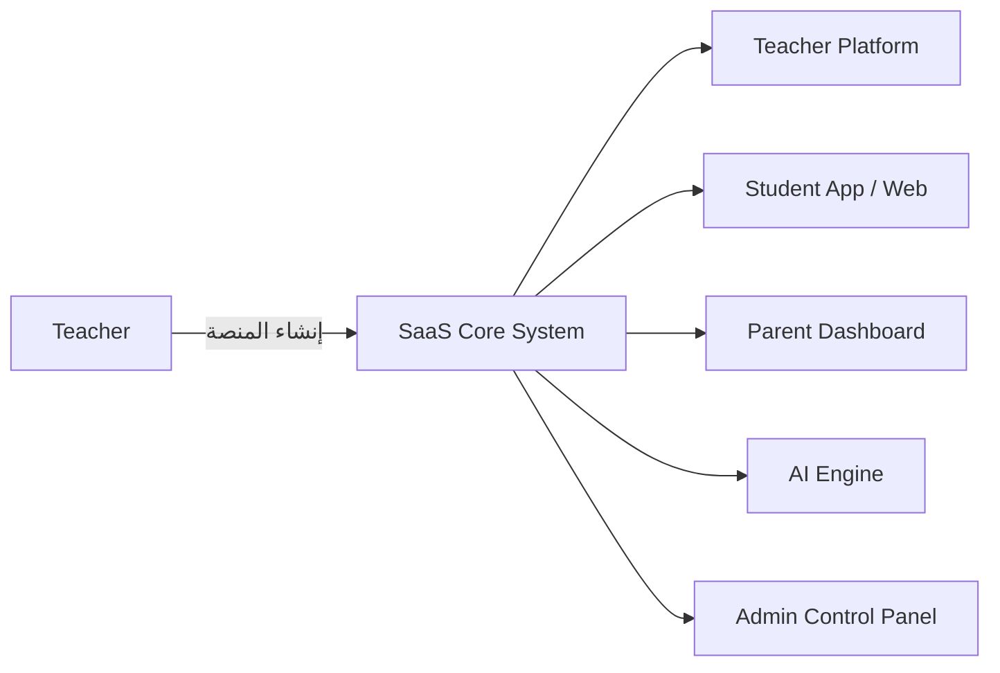

<h1 align="center">🎓 EdumustPlatform – نظام SaaS للمدرسين في مصر</h1>

<p align="center">
  <b>منصة تعليمية متكاملة تُمكّن المدرسين من إنشاء منصاتهم الخاصة بسهولة واحترافية</b><br>
  <i>قابلة للتوسع – مدعومة بالذكاء الاصطناعي – مصممة لتلائم التعليم المصري والعربي.</i>
</p>

---

## 🧭 مقدمة عن المشروع

يهدف هذا المشروع إلى إنشاء نظام **SaaS (Software as a Service)** مخصص للمدرسين في مصر،  
يتيح لهم بناء منصاتهم التعليمية الخاصة بسهولة من خلال واجهة استخدام رسومية **(GUI)** دون الحاجة إلى كتابة كود.

توفر المنصة أدوات متكاملة لإدارة:
> 📚 المحتوى – 👩‍🎓 الطلاب – 💰 المدفوعات – 🧠 الامتحانات – ⚙️ التفاعل والتحليلات – 🤖 الذكاء الاصطناعي لتحليل الأداء وتحسين تجربة التعلم.

---

## 🏗️ نظرة عامة على المنظومة

يتكون النظام من ثلاث طبقات رئيسية:

| الطبقة | الوصف |
|---------|--------|
| **لوحة إدارة مركزية (SaaS Dashboard)** | تحكم كامل في المنصات الفرعية، الخطط، الخصائص، الموارد، والتحليلات، وشراء منصة وتجديد الاشتراكات من المعلم وادارة منصاته. |
| **منصة المعلم (Teacher Platform)** | أدوات إدارة المناهج، الطلاب، الفيديوهات، المدفوعات، والاختبارات. |
| **منصة الطالب (Student Platform + Mobile App)** | واجهة تفاعلية للطلاب للوصول إلى الدروس، الواجبات، الامتحانات، والمحادثات. |

---

## 🎯 الرؤية المستقبلية

أن تصبح المنصة الخيار الأول للمدرسين في مصر لإدارة العملية التعليمية الرقمية بسهولة واحترافية،  
ثم التوسع تدريجيًا إلى المؤسسات التعليمية الحكومية والأسواق العربية المشابهة.

---

## 👥 الفئة المستهدفة

- 📘 المدرسون في المرحلة الثانوية.  
- 🏫 مراكز الدروس الخصوصية.  
- 🏛️ المدارس والمؤسسات التعليمية.

---

## 🌟 المميزات العامة للمنصة

### 👨‍🏫 للمدرسين

1. **تخصيص الهوية البصرية:** اختيار الألوان، القوالب (100+ قالب)، التصميم العام.  
2. **نظام تسجيل مرن وآمن:** (OTP / Gmail / Telegram / رقم الهاتف / 2FA).  
3. **إدارة الطلاب:** قبول يدوي أو تلقائي، تفعيل/تعطيل الحسابات.  
4. **إدارة المناهج:** إنشاء صفوف ودروس وفقرات متقدمة.  
5. **رفع الفيديوهات بجودات متعددة مع حماية المحتوى.**  
6. **تحديد عدد المشاهدات لكل فيديو وجدولة ظهوره.**  
7. **نظام تفاعل متكامل:** دعم فني، منتدى، تعليقات، إشعارات.  
8. **نظام امتحانات ذكي:** MCQ، Essay، نتائج فورية، مراقبة أداء.  
9. **لوحة تحكم تحليلية للمدرس.**  
10. **نظام نقاط وترتيب لتحفيز الطلاب.**  
11. **مدفوعات إلكترونية آمنة مع فواتير تلقائية.**  
12. **صفحات أولياء الأمور لمتابعة الأداء.**  
13. **أدوات ذكاء اصطناعي لتحليل الأداء وإنشاء المحتوى.**  
14. **نظام بث مباشر تفاعلي وجدولة المحاضرات.**

---

### 🧑‍🎓 للطلاب

- واجهة بسيطة وسريعة الاستجابة.  
- تسجيل الدخول عبر Google / Telegram / OTP.  
- لوحة تقدم دراسي تفاعلية.  
- إشعارات ذكية للواجبات والاختبارات.  
- ملاحظات شخصية ودروس مفضلة.  
- نظام تحفيزي بنقاط وترتيب بين الزملاء.  
- منتدى تفاعلي للمناقشات.  
- عرض الدروس والفيديوهات بترتيب منظم.  
- **ذكاء اصطناعي للإجابة على أسئلة الطالب** أثناء المذاكرة.

---

## ⚙️ إدارة النظام من قبل فريق SaaS

فريق المشروع يتحكم في النظام الأم من خلال لوحة مركزية تشمل:

| القسم | المهام |
|--------|--------|
| 🧑‍💼 إدارة المدرسين | إضافة / حذف / متابعة الاشتراكات وتفعيل الخصائص. |
| 💳 إدارة الخطط | تخصيص المزايا لكل خطة وتسعيرها. |
| 📊 التحليلات | مراقبة الأداء العام ومعدل النمو. |
| 💾 إدارة الموارد | إدارة السيرفرات، المساحة، الباندويدث. |
| 🧩 تطوير المزايا | إضافة خصائص جديدة بواجهة GUI وتفعيلها عند الطلب. |

---

## 🧱 آلية إنشاء منصة المدرس

1. يسجل المدرس في النظام الأساسي : بكتابة كل من (رقم الهاتف الاساسي للدخول به كل مرة , رقم هاتف فرعي(اختياري),ايميل , اسمه الاول واسمه الأخير
2. يستلم OTP علي هاتفه الخاص . بقوم بتفعيل الحساب .
3. يطلب من المدرس مراسلة فريق الدعم للحصول علي ثمن خطة مجانية ليقوم بشراء خصائص المنصة واستعمالها لمدة اسبوع للتحربة.
4. يمكن للمدرس بعد انتهاء الخطة المجانية :
  - يختار خطته (Free / Basic / Pro / Premium).  
  - يحدد خصائصه من خلال واجهة GUI مثل :  
       - الهوية البصرية (ألوان / شعار).  
       - طرق تسجيل الطلاب.  
       - طرق الدفع.  
       - تفعيل المنتدى أو الذكاء الاصطناعي. 
5. يقترح النظام اسم للمنصة بالبحث بخاصية ال Automation في مواقع مثل Godaddy / Porkhub / Namecheap ويحاول ايجاد دومين باسم المعلم firstname-lastname.com ويعرض الاسعار والعروض والخصائص لتمكين المعلم من اختيار السعر والمدة المناسبة له واعلامه بالسعر في السنوات التالية
6. بعد التأكد من رصيد المستخدم في الحساب يقوم النظام بسحب الرصيد وانشاء المنصة في الخلفية بشراء VPS وشراء دومين وانشاء SSL وتركيب المنصة وحسب خصائص المنصة يتم شراء الVPS وتركيب الfeatures 
7. يُنشئ النظام تلقائيًا منصة فرعية مخصصة باسم:  
   ```
   teachername.edu-saas.com
   ```
ويقوم بارسال رابط لوحة الادارة والباسورد نفس الباسورد الذي تم الدخول به علي لوحة الشراء .
8. يبدأ المدرس f\بعد الذهاب لمنصته بالدومين الجديد في رفع محتواه (دروس – امتحانات – ملفات).

---

## 💼 نموذج العمل (Business Model)

- نظام اشتراكات **شهرية / سنوية / فصلية** حسب حجم المنصة وعدد الطلاب.  
- **الخطط المتاحة:**

| الخطة | المميزات |
|--------|-----------|
| 🆓 Free Trial | فترة تجريبية بخصائص محدودة. |
| 💼 Standard | خصائص أساسية تناسب أغلب المدرسين. |
| 🚀 Premium | جميع المزايا باستثناء AI والبث المباشر الكامل. |
| 🧠 Enterprise | تتضمن أدوات الذكاء الاصطناعي والبث المباشر. |
| ⚙️ Custom | تخصيص المنصة حسب الطلب والسعر مرن. |

---

## 🧩 بنية المنصة (Architecture Overview)



---

## جميع الـ Features الأساسية والموسعة
1. تخصيص الألوان والقوالب.
2. تسجيل دخول مرن (كود / Gmail / رقم / 2FA / OTP).
3. إدارة الصفوف والدروس والفقرات.
4. تحديد مرات المشاهدة.
5. جدولة الظهور والإخفاء للفيديوهات.
6. تسجيل الطلاب بمرونة.
7. جمع بيانات تفصيلية أثناء التسجيل.
8. دعم متعدد القنوات للتواصل مع الدعم الفني.
9. روابط مباشرة لحسابات المعلم على وسائل التواصل.
10. حد أقصى للطلاب بالكورس.
11. المقالات والمدونات المرتبطة بالمناهج.
12. الواجبات والتصحيح.
13. نظام دفع ورصيد داخلي.
14. تسجيل الطالب حسب الشعبة.
15. نظام الإعلانات التلقائي.
16. Dashboard متقدمة للمدرس.
17. نظام امتحانات متكامل.
18. سجل الدخول وتحليل الأجهزة.
19. ترتيب الطلاب بالنقاط والمكافآت.
20. تطبيق موبايل مخصص للطلاب.
21. إشعارات وتنبيهات مستمرة.
22. صفحة ولي الأمر.
23. قائمة المفضلة.
24. منتدى تفاعلي.
25. وصف وتفصيل للفيديوهات مع Notes.
26. متجر كتب وملازم.
27. نظام فواتير الكترونية.
28. نظام بث مباشر بجدولة زمنية.
29. أدوات ترجمة أثناء الدراسة.
30. تحليل التفاعل مع الفيديوهات.
31. اقتراحات ذكية أثناء الفيديو.
32. دعم لغتين على الأقل (عربي/إنجليزي).
33. نظام وقت المذاكرة.
34. قياس مستوى التقدم في الكورسات.
35. MCQ Generator من الصور.
36. تتبع سلوك المشاهدة والتفاعل.
37. تسجيل وتتبع زمن الإجابة.
38. صلاحيات المساعدين.
39. OCR + Essay AI Correction.
40. Chatbot تفاعلي.
41. Focus Tracking.
42. Shorts Generator.
43. Predictive Analytics.
44. Notifications Engine.
45. Security Monitoring & Anti-Piracy.
46. Logs & Audit System.
47. Analytics Dashboard.
48. System Scaling Support.
49. إدارة مركزية للمدرسين والمنصات.
50. نظام خطط الاشتراك الديناميكية.
51. نظام نسخ احتياطي واستعادة تلقائية.
----

## 📚 مستودعات الفريق (Repositories)

| الريبو | التخصص | الفريق المسؤول |
|--------|---------|----------------|
| [edu-frontend](../../Frontend) | واجهات المستخدم (React / Next.js) | 🎨 Frontend Team |
| [edu-backend](../../Backend) | APIs والمنطق الخلفي (Django / FastAPI) | ⚙️ Backend Team |
| [edu-ai](../../AI) | الذكاء الاصطناعي والتحليل | 🤖 AI Team |


---


## 🧠 تقنيات أساسية

- **Frontend:** React / Next.js / TailwindCSS  
- **Backend:** Django / FastAPI / Celery / Redis  
- **Database:** PostgreSQL / MongoDB  
- **Storage:** DigitalOcean Spaces  
- **Payment:** Paymob / Fawry / Vodafone Cash  
- **Streaming:** Django Channels / WebSocket  
- **AI Engine:** Python ML / OCR / NLP  
- **DevOps:** Docker / Nginx / CI/CD  

---

<p align="center">© 2025 Edumust Team — جميع الحقوق محفوظة.</p>
